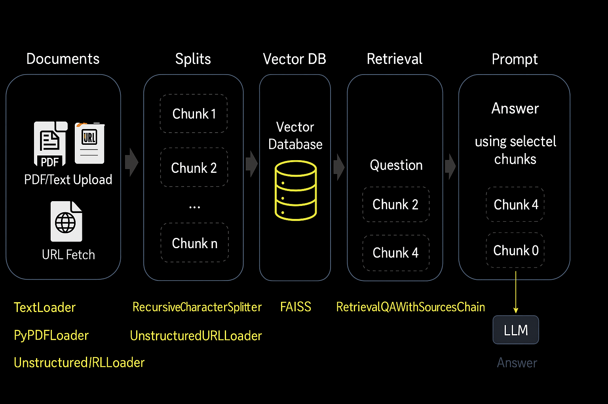

# 📚 EduBot: Academic Research Assistant

EduBot is a powerful Streamlit-based application designed to help researchers, students, and professionals easily **upload**, **fetch**, **summarize**, and **query** academic research papers using **LangChain**, **FAISS**, and **OpenAI's LLM**.



---

## ✨ Features

- 📥 Upload PDFs or text files
- 🌐 Fetch and process papers from URLs
- 🧠 Split documents into chunks and embed using FAISS
- 🤖 Ask academic questions and get accurate answers from the content
- 📌 Source tracking for every answer
- 💻 Beautiful and responsive Streamlit interface

---

## 🛠️ Tech Stack

- **Streamlit** – Frontend app framework
- **LangChain** – Document loaders, retrievers, and QA chain
- **OpenAI** – LLM and Embeddings (`gpt-3.5-turbo`)
- **FAISS** – Vector database for semantic search
- **Python** – Core language

---

## 🚀 Getting Started

### 1. Clone the Repository

```bash
git clone https://github.com/your-username/edubot.git
cd edubot
```

### 2. Install Dependencies

Create a virtual environment and install required packages:

```bash
pip install -r requirements.txt
```

> Make sure Python 3.8+ is installed.

### 3. Create a `.env` File

Create a `.env` file and add your OpenAI API key:

```
OPENAI_API_KEY=your_openai_key_here
```

### 4. Run the App

```bash
streamlit run main.py
```

The app will launch in your browser.

---

## 🖼️ Screenshot

Here's the visual workflow of how the app functions:


---

## 📂 File Structure

```
EduBot_Academic_Research_Assistant/
│
├── main.py
├── requirements.txt
├── democodepython/
├── vector_index.pkl
│
README.md
workflow.png

```

---

## 🙌 Credits

- Developed by **PKK**
- Powered by OpenAI, LangChain, and Streamlit

---

## 📄 License

This project is licensed under the MIT License.
